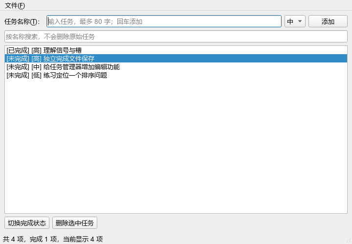
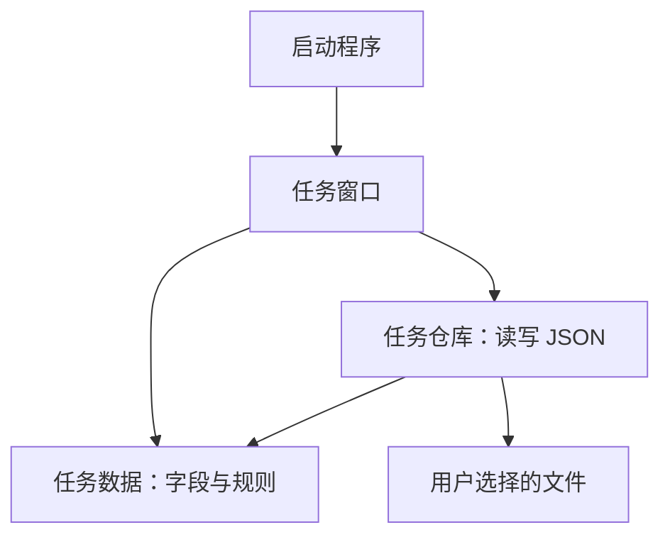

# 第 22 章　综合实战：桌面任务管理器

[上一章](21_扩展模块与技术选择.md) · [总目录](00_阅读地图与学习方法.md) · [下一章](23_独立开发训练与毕业考核.md)

这一章把前面的知识变成一个可以交付的小程序。不要一上来就读完整代码。先阅读需求，自己画出界面，尝试实现第一步，再逐步对照参考。



## 22.1 先把需求变成可以验收的行为

用户希望在桌面上记录学习任务，每条任务有名称、优先级和完成状态。需要添加、搜索、切换完成、删除、保存和重新打开。我们约定：名称去掉首尾空白后不能为空，最多 80 个字符；优先级只有低、中、高；重复名称允许存在，不同记录使用不同编号。

这里有三个经常被初学者漏掉的问题。第一，搜索后看到的第 0 行不一定是原始数据第 0 条，所以不能用显示行号删除原列表。第二，窗口里的数据和磁盘里的数据不是同一份，保存失败时不能告诉用户已经保存。第三，“关闭窗口”不是简单销毁控件，需要先决定是否保存尚未保存的更改。

| 用户动作 | 正常结果 | 必须处理的分支 |
|---|---|---|
| 添加 | 数据中增加一条记录，清空输入 | 空名称、超长名称、达到容量上限 |
| 搜索 | 显示名称包含关键词的记录 | 无结果时仍保留全部原始数据 |
| 完成/删除 | 通过记录编号找到正确数据 | 没选中时按钮不可用；删除需要确认 |
| 打开 | 全部校验成功后替换当前文档 | 取消、权限错误、坏 JSON、不兼容版本 |
| 保存 | 写入成功后取消标题星号 | 取消文件选择、目录不可写、替换失败 |
| 新建/打开/关闭 | 按用户选择继续 | 保存、放弃、取消，保存失败时不能继续丢弃 |

## 22.2 数据先于界面

一条任务使用 `Task` 表示，有 `id`、`title`、`priority`、`done` 四个字段。它没有按钮，没有列表，也不知道 Qt 的存在。

完整代码：[任务数据.py](综合实战/任务数据.py)。其中的 `@dataclass(frozen=True)` 会生成初始化、比较等方法，并限制普通方式修改字段。因此切换完成状态时，`toggled()` 用 `dataclasses.replace` 返回新对象，而不是偷偷改变旧对象。这样，修改发生在哪里比较容易追踪。

```python
# 片段：可在同目录交互环境中实验；需要先导入 Task。
task = Task.create("  学习布局  ", "高")
finished = task.toggled()
print(task.done)       # False，原对象没有改变
print(finished.done)   # True，新对象表示完成状态
```

`create()` 接受用户输入并去掉空白；`__post_init__()` 检查对象是否满足约定。文件中读出来的记录也会经过相同检查，所以即使界面已有 `setMaxLength(80)`，数据规则仍然保留。控件限制只是帮助用户，不能替代数据验证。

这里补充几个第一次读数据类时容易卡住的 Python 写法。`@classmethod` 让 `create()` 接收类本身作为第一个参数，约定写成 `cls`；因此可以直接调用 `Task.create(...)`，方法内部的 `cls(...)` 创建新实例。`__post_init__()` 不是任意类都会自动调用的魔法步骤：这里是 `@dataclass` 生成的初始化方法在字段赋值后调用它。仓库中的 `Task(**item)` 把字典按键展开为命名参数，例如 `{"id": "1", "title": "读书", "priority": "中", "done": False}` 会变成同名的四个构造参数。`asdict(task)` 则把数据类转换成字典，供 JSON 序列化使用。

UUID 用于给记录一个不依赖位置的编号。它不是密码，也不代表数据库已经保存成功。只要任务存在，它的编号就保持稳定；显示顺序变化不会改变编号。

## 22.3 保存格式也是一种接口

[任务仓库.py](综合实战/任务仓库.py) 接收 `Path` 和 `list[Task]`，负责读取与写入。JSON 最外层保留版本号：

```json
{
  "version": 1,
  "tasks": [
    {"id": "演示编号", "title": "学习布局", "priority": "高", "done": false}
  ]
}
```

为什么需要 `version`？未来如果增加截止日期，旧文件可能没有该字段，你需要明确决定“给旧文件补默认值”还是“提示版本不支持”。没有版本约定时，兼容逻辑容易散落在各处。

`load()` 的顺序是读文本、解析 JSON、检查外层和版本、检查列表、逐条构造任务、检查重复编号，最后才返回新列表。它不会边读边改当前界面，因此第 20 条记录出错时，原文档仍然完整。

`save()` 先把完整内容转成文本，再在目标目录创建临时文件，写入并关闭后用 `os.replace()` 替换目标。它解决的是“直接清空旧文件后写到一半失败”的常见问题。同一文件系统上的替换通常具有原子性，但这不是历史备份，也不能保证所有网络盘、断电、硬件故障和并发编辑场景都安全。重要数据仍应另有备份方案。

`tempfile.NamedTemporaryFile` 自动产生不易冲突的名字；`delete=False` 让它关闭后仍存在，以便 Windows 执行替换；`finally` 无论成功失败都尝试清理临时文件。这里不自动创建用户选定路径的父目录，路径不可用时直接报告失败。

## 22.4 文件分工与调用方向



入口组装对象；界面调用数据规则与仓库；仓库不反过来弹窗口。这样测试仓库时无需创建 `QApplication`，保存失败怎样显示由界面决定。

不需要为了“分层”立即再建十几个目录。当前窗口管理一份小文档，操作很少，协调逻辑留在窗口是合理的。当一套业务被多个窗口、命令行或网络接口复用时，再把协调逻辑提取为服务。

## 22.5 窗口中的四类状态

[任务窗口.py](综合实战/任务窗口.py) 比数据文件长，因为它处理许多用户操作。先抓住这四类状态：

| 状态 | 存在哪里 | 作用 |
|---|---|---|
| 全部任务 | `self.tasks` | 内存中的事实来源，保存使用它 |
| 当前文件路径 | `self.current_path` | `None` 表示还没选过保存位置 |
| 是否修改 | `self.dirty` | 只有成功保存、成功打开或确认新建后才清除 |
| 搜索与选中 | 控件内部 | 影响显示和操作目标，不是任务业务数据 |

`_build_ui()` 建控件和布局，`_build_actions()` 建菜单操作，`_connect_signals()` 连交互，`_refresh()` 把数据投影到界面。下划线表示“主要供本类内部使用”的约定，并不是 Python 强制的私有权限。

`_refresh()` 重建列表时把任务编号写进每个条目的 `UserRole`，显示文字只是给人看的。`_selected_id()` 取出编号，切换或删除按编号操作 `self.tasks`。这就是“显示行”和“记录身份”分开的实际用法。

这里使用 `selectedItems()` 判断真实选中状态，因为 `currentItem()` 表示当前项，用户按 Ctrl 取消选中后，它仍可能保留键盘焦点。当前项和选中项不总是一回事；按钮是否启用，应符合实际选中状态。

搜索使用 `casefold()` 做不区分大小写的文本比较，输入去掉首尾空白。中文匹配仍按包含关系判断。搜索结果为空不表示数据为空；状态栏分别显示总数、完成数和可见数。

## 22.6 沿一次“添加”追踪程序

1. 用户点击添加或按回车，信号调用 `add_task()`。
2. 从输入框和下拉框读取文本。
3. 调用 `Task.create()`，规则失败就提示并返回。
4. 成功才把任务放入 `self.tasks`，设置 `dirty=True`。
5. 清空输入，重建展示，把键盘焦点交回输入框。

关键在“成功才修改”。如果你先 `append()` 再验证，就必须写回滚逻辑。尽量把验证放在状态变化之前，代码会简单很多。

可以在这五步各放一个断点，观察按钮点击不会让整个程序“从入口再跑一遍”。事件循环只是把这一次事件交给相关槽函数处理。

## 22.7 保存必须返回成功或失败

`save_document()` 返回 `bool`。返回 `True` 表示本次保存真正成功；取消路径选择和文件写入失败都返回 `False`。菜单通常不关心返回值，但退出确认必须关心。

`_allow_discard()` 统一处理未保存分支：无需保存时返回真；选保存就返回 `save_document()` 的结果；选放弃返回真；选取消返回假。`closeEvent()` 根据结果 `accept()` 或 `ignore()`。

不要写成“用户按了保存按钮，所以允许关闭”。用户按保存后还可能取消文件选择，或者磁盘写入失败。只有实际结果才能决定下一步。

`save_document(self, checked=False, *, save_as=False)` 中，`checked` 接收 QAction 的布尔参数，星号后面的 `save_as` 只能按关键字传入。“另存为”通过一个无参数 lambda 明确传 `save_as=True`，避免把 QAction 的参数误当成业务选项。

## 22.8 打开文件为什么校验后还可能再读取一次

先选择文件并校验，坏文件直接报告，避免为了一个根本打不开的文件让用户放弃当前修改。随后询问当前文档是否保存。如果用户选择保存，而且恰好保存到即将打开的同一文件，它的内容就改变了，所以提交打开前再次读取。

这是一个小但真实的状态问题：对话框期间也可能发生影响结果的动作，早先读取的快照未必仍是最新。教学版仍不提供跨进程文件锁；两个程序同时改同一文件时应设计冲突检测，不能仅凭此处的重读认为并发问题已经解决。

## 22.9 按六个阶段亲手做

| 阶段 | 只做这些 | 当场验收 |
|---|---|---|
| 1 | Task 和验证 | 空白被拒绝，正常标题去空格，完成切换不改原对象 |
| 2 | 输入框、添加按钮、列表 | 能添加两条同名但独立的任务 |
| 3 | 搜索、按编号完成/删除 | 搜索后操作不会误删被隐藏的任务 |
| 4 | 仓库与菜单保存/打开 | 中文往返保持一致，坏文件不替换原文档 |
| 5 | dirty 与关闭确认 | 取消或保存失败均保留窗口和原内容 |
| 6 | 测试、打包、说明 | 在另一环境按运行说明复现核心功能 |

完整入口：[启动程序.py](综合实战/启动程序.py)。运行方法见[运行说明](综合实战/运行说明.md)。参考实现选择显式保存，以便你看清状态；自动保存可以作为后续练习，但必须重新设计错误提示和恢复策略。

## 22.10 验收与自动测试

[测试任务仓库.py](综合实战/测试任务仓库.py) 使用标准库 `unittest` 和临时目录。它验证中文及完成状态往返、空列表、无效输入、版本、字段、编号重复，以及替换失败时旧文件保留与临时文件清理。测试中 `patch()` 把 `os.replace` 暂时换成抛出异常的函数，以稳定地模拟文件不可替换，无需真的破坏磁盘权限。

[测试任务窗口.py](综合实战/测试任务窗口.py) 用 `QTest` 点击真实按钮，并预设对话框回答，验证搜索后的操作目标、保存取消、保存失败时拒绝关闭等行为。用 `patch()` 代替对话框，是为了让测试可重复运行；原生对话框本身和真实输入法仍需要人工体验。

仍要亲自验收界面：

- 新建两条任务，搜索其中一条，再完成或删除它，确认另一条还在。
- 保存后修改，分别走“取消退出”“放弃退出”“保存退出”。
- 首次关闭时选保存，再取消文件选择，确认窗口仍在。
- 打开坏 JSON，确认当前内容与标题路径没有被换掉。
- 另存为一个新文件，确认旧文件内容没被本次另存为改变。
- 调整窗口尺寸，使用 Tab、回车和菜单快捷键完成操作。

教学版每次刷新都会重建列表，适合小规模数据。虽然设置了 10000 条的格式上限，这不是流畅运行 10000 条的性能承诺；需要大数据时应基于第 12 章的模型视图实现局部更新。其他留给你扩展的部分包括编辑名称、撤销、分组、多文件最近记录、自动备份和数据库存储。

## 本章练习与自检

1. 增加“仅看未完成”选项，同时与关键词筛选共同生效。先写出四种组合的预期结果。
2. 增加编辑名称：复用现有验证，取消对话框时不改变任务，保存后编号保持不变。
3. 给仓库增加一项测试：未知字段是否应拒绝？先明确兼容约定再改代码。
4. 把列表改为 `QTableView`，支持优先级排序，排序后仍能准确操作记录。
5. 用纸解释：为什么保存失败后不能把 `dirty` 设为假？为什么 UI 不负责解析 JSON 的每个字段？

能够不看代码画出“点击 → 读取输入 → 验证 → 修改数据 → 刷新”的路径，并独立补一个功能，才算完成这一章。下一章会把完整参考实现拿走，让你真正练习独立开发。
