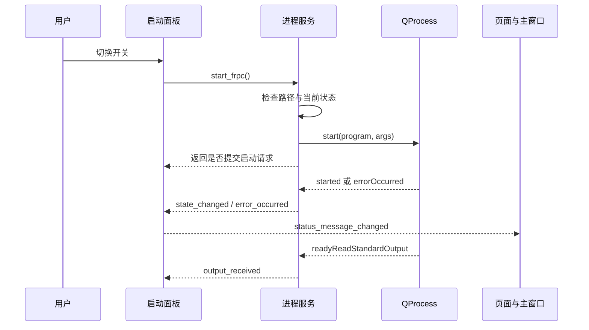

# 第 26 章　从教材走进 EasyFrp 源码

[上一章](25_练习提示与参考思路.md) · [总目录](00_阅读地图与学习方法.md) · [下一章](27_示例验证记录.md)

本章以当前工作区的 EasyFrp 源码为阅读材料。它不是让你立刻修改实际配置或启动 FRP 服务；先通过源码、断点规划和调用图理解职责。真实项目会演进，下面使用类名和方法名定位，避免把固定行号当成永久依据。

## 26.1 先看启动链，不要按文件夹顺序读完

从[项目入口](../../main.py)开始。入口用自身文件路径找到 `src`，将其加入模块搜索路径，然后导入 `frp_gui.app.run`。它还使用 `if __name__ == "__main__"`，避免被导入时自动启动窗口。

接着读[应用启动模块](../../src/frp_gui/app.py)。`create_application()` 创建 `QApplication` 并设置应用身份；`run()` 准备目录、创建应用、实例化主窗口、显示、进入事件循环。把它与第 03 章的最小程序对比，骨架是相同的，只是启动前增加了项目资源准备。

注意 `ensure_runtime_directories()` 会创建运行目录并可能复制缺失的默认配置。理解启动链不必立刻运行整个项目；阅读时区分“纯对象组装”和“会修改文件系统的动作”。教材示例的运行不会调用这个函数。

## 26.2 主窗口负责把页面组合起来

[MainWindow](../../src/frp_gui/ui/main_window.py) 使用侧边 `QListWidget` 和右侧 `QStackedWidget`。阅读顺序建议是 `__init__()` → `_register_page()` → `_build_ui()` → `_connect_signals()` → `_refresh_sidebar_for_mode()`。

`_register_page()` 建页面对象，`_build_ui()` 放进布局与堆栈，`_connect_signals()` 建关系。侧边栏行号不是直接等于固定页面编号，因为 frpc/frps 模式可能展示不同导航条目，所以项目使用 `_sidebar_page_routes` 映射。这正对应本书强调的“界面位置”和“业务身份/目标”分离。

重建导航时使用 `blockSignals(True)`，避免清空、插入、选中条目期间触发中间状态处理。结束后恢复信号并明确处理最终选中页。阅读时思考：如果过程抛出异常，怎样确保一定恢复？第 07 章的 `QSignalBlocker` 是可比较的另一种方案。

项目当前主窗采用固定尺寸。这是当前实现的取舍，不是所有 Qt 项目必须固定窗口。复习第 06 和 14 章后，可以单独在练习项目里比较固定尺寸与响应布局对字体放大和长文本的影响。

## 26.3 沿一次“启动 frpc”追踪

相关文件：

| 文件 | 阅读重点 |
|---|---|
| [通用开关](../../src/frp_gui/ui/widgets/switch_button.py) | `SwitchButton` 如何基于 QCheckBox 表达开关状态 |
| [启动面板](../../src/frp_gui/ui/panels/frpc_open.py) | `FrpcOpenPanel` 如何响应操作、禁用按钮、显示状态 |
| [控制页面](../../src/frp_gui/ui/pages/frpc_control_view.py) | 页面怎样组织面板和转发消息 |
| [进程服务](../../src/frp_gui/backend/frpc/process_service.py) | QProcess 如何启动、读输出、报告失败与结束 |
| [主窗口](../../src/frp_gui/ui/main_window.py) | 收到消息后如何显示公共状态 |

服务的 `start_frpc()` 返回真，表示已经提交启动请求，不表示 FRP 已经成功连接远程服务器。`QProcess.started` 说明系统创建了子进程，也不等于该进程的业务准备全部完成。如果未来要显示“远程连接成功”，需要解析进程提供的协议、状态接口或可靠日志，定义另外一层业务状态。

这是初学者经常混淆的三个时刻：按钮被点击、系统程序已启动、程序内部业务已就绪。把三者分清，界面才不会过早显示成功。

## 26.4 状态如何返回到控件

阅读 `FrpcProcessState` 可以看到 stopped、starting、running、stopping。服务负责维护状态，面板根据状态调整开关文字、选中和可用性。不要只在按钮点击时盲目反转文字，否则外部进程崩溃时界面会停留在错误状态。

面板中 `_syncing_switch` 用于区分“用户操作开关”与“代码同步开关显示”。后者也可能触发 `toggled`，如果无保护，就可能又发起启停命令。它是第 07 章反馈循环问题在真实项目中的例子。

控制页面将面板的 `status_message_changed` 连接到自己同名信号的 `emit`。这是信号转发：外层不必知道页面里面有哪些具体控件，仍能收到适合公共状态栏的消息。

## 26.5 读配置与路径，而不是只看窗口

接着读[frpc 配置服务](../../src/frp_gui/backend/frpc/config_service.py)的 `load_text()`、`validate_text()`、`save_text()`，观察它怎样将文件处理结果返回给界面。这里使用 TOML，教材实战使用 JSON，文件格式不同，但“解析、验证、写入、错误呈现”的职责划分可以迁移。

[设置服务](../../src/frp_gui/backend/settings/settings_service.py)还包含默认值和规范化逻辑。思考外部文件的值是否一定具有正确类型，例如字符串 `"false"` 与布尔值 `False` 并不是一回事。你在第 22 章中学到的严格校验，就是防止这些输入悄悄改变业务判断。

[路径模块](../../src/frp_gui/utils/paths.py)区分运行根目录和打包资源根目录。当前实现把打包后的可写目录放在可执行文件旁，属于便携式分发的一种选择；如果装到受保护的目录，写权限就需要重新考虑。第 13、20 章介绍的 `QStandardPaths` 是另一种适合用户数据的选择，不能把某个项目路径策略当成所有程序的统一规则。

## 26.6 真实代码也值得提出问题

读代码不是背注释，而是用行为验证设计。以下是阅读练习，不是本次对业务源码的修改：

- 进程服务当前按每次读取的字节直接解码，再 `strip()`。若 UTF-8 字符跨两次读取，或者需要保留日志空行，会出现什么？与第 16 章的增量解码比较。
- 退出路径中的 `shutdown()` 使用有超时的 `waitForFinished()`。调用期间主线程能否继续处理普通界面事件？与第 15、16 章的延后关闭方案比较。
- 返回值只表示“请求已提交”时，界面文案该写“正在启动”还是“启动成功”？
- 重建导航、同步开关、自动启动，都可能产生信号；哪些信号应该被暂时屏蔽，哪些必须显式通知？

这些问题不是要求你为了理论上的完美立即重构。先明确使用场景、复现行为和改动价值，再决定是否修改。

## 26.7 一次有目标的源码阅读练习

选择“用户停止 frpc”这一条路径，独立写一页说明：从哪个信号开始，经过哪几个方法，谁改变状态，温和停止失败后怎样处理，最后哪个地方恢复按钮可用。然后把“子进程自己退出”和“启动文件不存在”也各走一遍。

需要调试时，先使用第 16 章自己的演示子进程练习断点和日志；掌握过程后，再在你明确准备好的真实运行环境中验证项目。不要为了学一个信号而同时引入服务器、权限、网络和配置等多种变量。

完成标准：你能在不通读全部文件的情况下，通过用户动作定位相关层，并判断一个改动应该放在控件、面板、页面、服务还是数据模型。达到这里，你已经从“看到很多文件就无从下手”进入了有方法的项目阅读。
