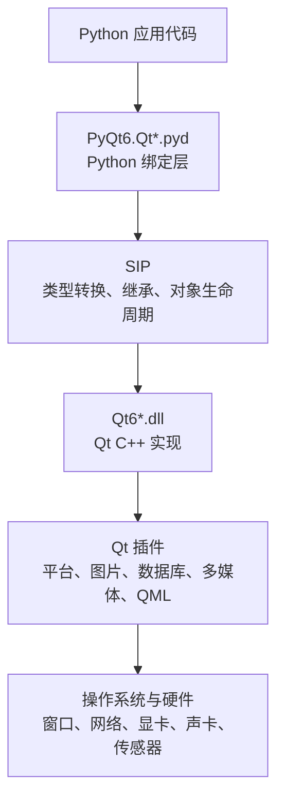
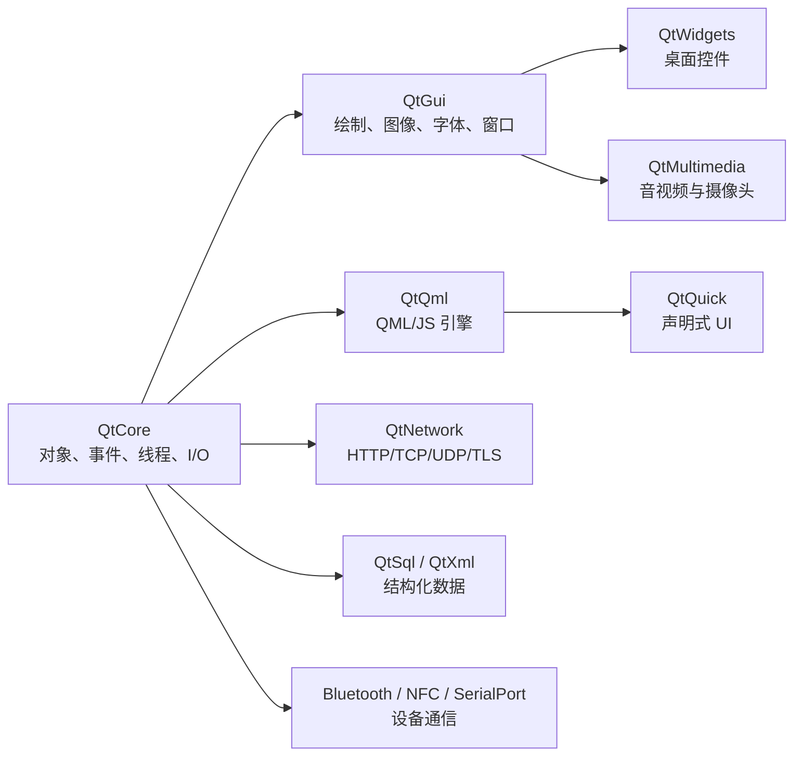
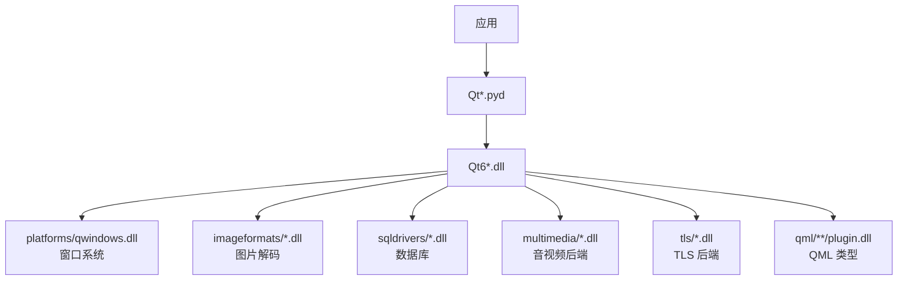

# PyQt6 模块详解与实战指南

> 面向 PyQt6 6.11.x / Qt 6.11.x，系统介绍官方基础发行版中的 35 个 Python 绑定模块、代表类、典型调用方式与选型建议。

---

## 目录

- [阅读说明](#1-阅读说明)
- [模块全景与选型](#2-模块全景与选型)
- [第一部分：基础、绘制与桌面界面](#第一部分基础绘制与桌面界面)
- [第二部分：QML、Qt Quick 与现代图形界面](#第二部分qmlqt-quick-与现代图形界面)
- [第三部分：网络、进程通信与硬件](#第三部分网络进程通信与硬件)
- [第四部分：多媒体、数据、文档与测试](#第四部分多媒体数据文档与测试)
- [第五部分：绑定层、工具链和插件](#第五部分绑定层工具链和插件)
- [第六部分：实战建议与排错](#第六部分实战建议与排错)
- [35 个模块速查表](#45-模块速查表)

---

## 1. 阅读说明

本文以当前项目锁定的 `PyQt6==6.11.0` 和本机安装的 Qt 6.11.1 为基准。不同操作系统、PyQt6 版本以及额外安装的扩展包可能使模块清单略有变化。

需要先明确一点：官方 PyQt6 并不存在一个容纳全部功能的单体 `PyQt6.dll`。在 Windows 上，PyQt6 由三层主要组件组成：

- `QtCore.pyd`、`QtWidgets.pyd` 等：Python 可以直接导入的二进制扩展模块；
- `Qt6Core.dll`、`Qt6Widgets.dll` 等：Qt 的 C++ 运行库；
- `platforms`、`imageformats`、`sqldrivers`、`multimedia`、`qml` 等目录：按需加载的运行时插件。



### 1.1 示例约定

- 示例默认使用 Python 3.10 或更高版本。
- 同一进程只能有一个 `QCoreApplication`、`QGuiApplication` 或 `QApplication` 实例。
- 标为“可直接运行”的例子只依赖 PyQt6；标为“环境相关”的例子还需要硬件、驱动、外部文件或操作系统服务。
- 为突出 API 用法，示例省略了生产环境中应有的异常处理、日志、资源释放和用户提示。
- 相对文件名，例如 `demo.pdf`、`video.mp4`，均相对于程序的当前工作目录。

### 1.2 应用对象应该选哪一个

| 应用对象 | 适用场景 |
|---|---|
| `QCoreApplication` | 命令行、网络服务、串口服务等不显示 GUI 的 Qt 程序 |
| `QGuiApplication` | 使用 QtGui、Qt Quick，但不使用 QWidget 的图形程序 |
| `QApplication` | 使用 QtWidgets 的传统桌面程序；它继承自 `QGuiApplication` |

---

## 2. 模块全景与选型



| 需求 | 首选模块 |
|---|---|
| 普通 Windows 桌面软件 | `QtCore + QtGui + QtWidgets` |
| HTTP、TCP、UDP、TLS | `QtNetwork` |
| SQLite、ODBC 数据库 | `QtSql` |
| 串口工具 | `QtSerialPort` |
| 音视频播放器 | `QtMultimedia + QtMultimediaWidgets` |
| PDF 阅读器 | `QtPdf + QtPdfWidgets` |
| QML 动态界面 | `QtQml + QtQuick` |
| QWidget 中嵌入 QML | `QtQuickWidgets` |
| OpenGL 视图 | `QtOpenGL + QtOpenGLWidgets` |
| Windows COM/ActiveX | `QAxContainer` |

---

# 第一部分：基础、绘制与桌面界面

## 3. `PyQt6.QtCore`：非图形基础设施

### 模块职责

`QtCore` 是几乎所有 Qt 模块的地基。它不负责显示按钮或窗口，而是提供：

- `QObject` 对象树、父子所有权和元对象系统；
- 信号与槽、属性、事件循环、定时器；
- 线程、线程池、互斥量和进程管理；
- 文件、目录、标准路径、设置、资源系统；
- 日期时间、URL、JSON、CBOR、正则表达式；
- Model/View 架构的抽象模型；
- 动画、基础数据类型及国际化工具。

### 代表类与功能

| 类/接口 | 功能 |
|---|---|
| `QObject` | Qt 对象模型的根类，提供父子对象管理、事件、属性、信号和槽 |
| `pyqtSignal` / `pyqtSlot` | 声明信号和槽，在对象之间进行低耦合通信 |
| `QTimer` | 在事件循环中执行一次性或周期性定时任务，不阻塞 GUI |
| `QThread` / `QThreadPool` | 执行后台任务，避免耗时工作卡住主线程 |
| `QFile` / `QDir` / `QStandardPaths` | 文件、目录及跨平台标准目录访问 |
| `QSettings` | 使用注册表、INI 或平台原生机制保存应用配置 |
| `QProcess` | 启动子进程并异步读取标准输出和错误输出 |
| `QAbstractItemModel` | 表格、树和列表模型的抽象基础，供视图控件显示数据 |
| `QPropertyAnimation` | 对 QObject 属性执行基于时间的插值动画 |

### 示例 1：信号、槽与定时器

下面的例子不创建窗口，每 500 毫秒发出一次计数信号，到 5 后退出。

```python
import sys

from PyQt6.QtCore import QCoreApplication, QObject, QTimer, pyqtSignal, pyqtSlot


class Counter(QObject):
    value_changed = pyqtSignal(int)

    def __init__(self):
        super().__init__()
        self.value = 0
        self.timer = QTimer(self)
        self.timer.setInterval(500)
        self.timer.timeout.connect(self.increase)

    @pyqtSlot()
    def increase(self):
        self.value += 1
        self.value_changed.emit(self.value)
        if self.value >= 5:
            QCoreApplication.quit()


app = QCoreApplication(sys.argv)
counter = Counter()
counter.value_changed.connect(lambda value: print("当前计数：", value))
counter.timer.start()
sys.exit(app.exec())
```

### 示例 2：持久化配置

```python
from PyQt6.QtCore import QSettings

settings = QSettings("EasyFrp", "DesktopClient")
settings.setValue("window/width", 1024)
settings.setValue("network/auto_connect", True)

width = settings.value("window/width", 800, type=int)
auto_connect = settings.value("network/auto_connect", False, type=bool)
print(width, auto_connect)
```

> `QThread` 的常见正确做法是把工作 `QObject` 通过 `moveToThread()` 移到线程中，并使用信号传递结果；不要在后台线程直接修改 QWidget。

---

## 4. `PyQt6.QtGui`：绘制、图像、字体与窗口系统

### 模块职责

`QtGui` 提供 GUI 的底层能力。它既包含图像、颜色、画笔和字体，也包含键鼠事件、剪贴板、拖放、窗口、Action、文本排版、标准数据模型及 OpenGL 上下文。

### 代表类与功能

| 类 | 功能 |
|---|---|
| `QGuiApplication` | 管理非 QWidget 图形应用的事件循环、屏幕和全局状态 |
| `QPainter` | 在图片、窗口、打印机等绘制设备上绘制文字、线条和图形 |
| `QImage` | 面向像素访问和 I/O 的图像对象，适合处理和保存图片 |
| `QPixmap` | 面向屏幕显示优化的图像对象，常用于标签、图标和缓存 |
| `QIcon` | 管理不同尺寸、状态和分辨率的图标 |
| `QFont` / `QFontMetrics` | 设置字体并测量文字宽度、高度等排版数据 |
| `QAction` | 可被菜单、工具栏、快捷键共同复用的用户操作 |
| `QStandardItemModel` | 通用列表、表格和树模型，可与 Item View 配合 |
| `QClipboard` | 访问系统剪贴板 |

### 示例：在内存图片上绘制并保存

```python
import sys

from PyQt6.QtCore import Qt
from PyQt6.QtGui import QColor, QFont, QGuiApplication, QImage, QPainter, QPen

app = QGuiApplication(sys.argv)

image = QImage(640, 360, QImage.Format.Format_ARGB32)
image.fill(QColor("#101827"))

painter = QPainter(image)
painter.setRenderHint(QPainter.RenderHint.Antialiasing)
painter.setPen(QPen(QColor("#60a5fa"), 6))
painter.drawRoundedRect(40, 40, 560, 280, 24, 24)

painter.setPen(QColor("white"))
painter.setFont(QFont("Microsoft YaHei", 26))
painter.drawText(image.rect(), Qt.AlignmentFlag.AlignCenter, "Hello, PyQt6")
painter.end()

image.save("qtgui-demo.png")
```

> `QImage` 更适合像素处理及后台线程；`QPixmap` 依赖 GUI 子系统，通常应在 GUI 线程中创建和使用。

---

## 5. `PyQt6.QtWidgets`：传统桌面控件

### 模块职责

`QtWidgets` 提供经典桌面应用需要的窗口、控件、布局、对话框、菜单、工具栏以及 Model/View 视图。它适合工具软件、管理后台、IDE、配置程序和数据录入软件。

### 代表类与功能

| 类 | 功能 |
|---|---|
| `QApplication` | QWidget 应用入口，管理事件循环、样式和全局界面状态 |
| `QWidget` | 所有可视控件的基础类，也可以作为自定义控件或普通窗口 |
| `QMainWindow` | 提供菜单栏、工具栏、状态栏、停靠面板和中心区域 |
| `QDialog` | 模态或非模态对话框基础类 |
| `QPushButton` / `QLineEdit` | 按钮和单行文本输入 |
| `QVBoxLayout` / `QGridLayout` | 自动排列子控件并处理窗口缩放 |
| `QListView` / `QTableView` / `QTreeView` | 分别显示列表、表格和树模型 |
| `QFileDialog` / `QMessageBox` | 系统文件选择和消息对话框 |

### 示例 1：创建一个简单窗口

```python
import sys

from PyQt6.QtWidgets import (
    QApplication,
    QLabel,
    QLineEdit,
    QMainWindow,
    QPushButton,
    QVBoxLayout,
    QWidget,
)


class MainWindow(QMainWindow):
    def __init__(self):
        super().__init__()
        self.setWindowTitle("PyQt6 Widgets 示例")

        self.input = QLineEdit()
        self.input.setPlaceholderText("请输入名字")
        self.output = QLabel("等待输入")
        button = QPushButton("问候")
        button.clicked.connect(self.say_hello)

        layout = QVBoxLayout()
        layout.addWidget(self.input)
        layout.addWidget(button)
        layout.addWidget(self.output)

        container = QWidget()
        container.setLayout(layout)
        self.setCentralWidget(container)

    def say_hello(self):
        name = self.input.text().strip() or "访客"
        self.output.setText(f"你好，{name}！")


app = QApplication(sys.argv)
window = MainWindow()
window.resize(420, 220)
window.show()
sys.exit(app.exec())
```

### 示例 2：用模型驱动表格视图

```python
import sys

from PyQt6.QtGui import QStandardItem, QStandardItemModel
from PyQt6.QtWidgets import QApplication, QTableView

app = QApplication(sys.argv)

model = QStandardItemModel()
model.setHorizontalHeaderLabels(["模块", "用途"])
model.appendRow([QStandardItem("QtCore"), QStandardItem("对象与事件")])
model.appendRow([QStandardItem("QtWidgets"), QStandardItem("桌面控件")])

view = QTableView()
view.setModel(model)
view.resize(520, 240)
view.show()

sys.exit(app.exec())
```

> 大量数据应优先使用 `QTableView + QAbstractTableModel`，而不是逐个创建 `QTableWidgetItem`。前者可以按需提供数据，更适合解耦、排序和大数据量场景。

---

## 6. `PyQt6.QtPrintSupport`：打印与打印预览

### 模块职责

负责打印机枚举、页面设置、系统打印对话框、打印预览以及把绘制内容输出到 PDF。

### 代表类与功能

| 类 | 功能 |
|---|---|
| `QPrinter` | 表示打印设备，也可配置为 PDF 输出设备 |
| `QPrinterInfo` | 查询默认打印机及可用打印机 |
| `QPrintDialog` | 显示系统打印对话框 |
| `QPageSetupDialog` | 设置纸张大小、方向和页边距 |
| `QPrintPreviewDialog` | 显示打印预览，并通过信号请求应用绘制页面 |

### 示例：使用打印系统生成 PDF

```python
import sys

from PyQt6.QtGui import QPainter
from PyQt6.QtPrintSupport import QPrinter
from PyQt6.QtWidgets import QApplication

app = QApplication(sys.argv)

printer = QPrinter(QPrinter.PrinterMode.HighResolution)
printer.setOutputFormat(QPrinter.OutputFormat.PdfFormat)
printer.setOutputFileName("print-demo.pdf")
printer.setDocName("PyQt6 打印示例")

painter = QPainter(printer)
painter.drawText(300, 500, "这段文字由 QPrinter 输出到 PDF")
painter.end()
```

`QPrinter` 本身不决定打印什么；应用必须使用 `QPainter`，或让 `QTextDocument.print()` 把内容绘制到打印设备。

---

## 7. `PyQt6.QtSvg`：SVG 解析、渲染与生成

### 模块职责

`QtSvg` 用于加载和渲染 SVG 矢量图片，也可以把 Qt 绘图命令写入新的 SVG 文件。

### 代表类与功能

| 类 | 功能 |
|---|---|
| `QSvgRenderer` | 从文件或字节加载 SVG，并绘制到任意 `QPainter` 设备 |
| `QSvgGenerator` | 作为绘图设备，把 `QPainter` 操作保存成 SVG |

### 示例：把 SVG 渲染成 PNG

```python
from PyQt6.QtCore import QByteArray
from PyQt6.QtGui import QColor, QImage, QPainter
from PyQt6.QtSvg import QSvgRenderer

svg = QByteArray(b"""
<svg xmlns="http://www.w3.org/2000/svg" width="200" height="200">
  <rect x="10" y="10" width="180" height="180" rx="24" fill="#2563eb"/>
  <circle cx="100" cy="100" r="52" fill="white"/>
</svg>
""")

renderer = QSvgRenderer(svg)
image = QImage(400, 400, QImage.Format.Format_ARGB32)
image.fill(QColor("transparent"))

painter = QPainter(image)
renderer.render(painter)
painter.end()
image.save("svg-rendered.png")
```

> Qt SVG 适合图标和常规矢量图，但不等同于完整浏览器 SVG 引擎，复杂脚本、CSS 或浏览器专属特性可能不受支持。

---

## 8. `PyQt6.QtSvgWidgets`：在 Widgets 中显示 SVG

### 代表类与功能

| 类 | 功能 |
|---|---|
| `QSvgWidget` | 在 QWidget 界面中加载和显示 SVG |
| `QGraphicsSvgItem` | 在 `QGraphicsScene` 中显示可变换的 SVG 图元 |

### 示例：SVG 查看窗口

```python
import sys

from PyQt6.QtSvgWidgets import QSvgWidget
from PyQt6.QtWidgets import QApplication

app = QApplication(sys.argv)
viewer = QSvgWidget("logo.svg")
viewer.setWindowTitle("SVG Viewer")
viewer.resize(480, 360)
viewer.show()
sys.exit(app.exec())
```

这个例子需要当前目录存在 `logo.svg`。如果要动态缩放、旋转和组合多个图元，可以将 `QGraphicsSvgItem` 放入 `QGraphicsScene`，再通过 `QGraphicsView` 显示。

---

## 9. `PyQt6.QtOpenGL`：OpenGL 资源封装

### 模块职责

`QtOpenGL` 封装 OpenGL 缓冲、纹理、着色器、帧缓冲、计时查询和调试日志。它管理资源及跨平台上下文集成，但不会替你设计渲染管线。

### 代表类与功能

| 类 | 功能 |
|---|---|
| `QOpenGLBuffer` | 管理顶点缓冲、索引缓冲等 GPU Buffer |
| `QOpenGLTexture` | 创建、上传和设置 OpenGL 纹理 |
| `QOpenGLShader` | 编译单个顶点、片元或计算着色器 |
| `QOpenGLShaderProgram` | 链接 Shader，并设置 Attribute 与 Uniform |
| `QOpenGLFramebufferObject` | 离屏渲染到纹理或渲染缓冲 |
| `QOpenGLDebugLogger` | 接收 OpenGL 驱动的调试消息 |

### 示例：在当前上下文中创建离屏帧缓冲

`QOpenGLFramebufferObject` 必须在 OpenGL 上下文已经成为当前上下文时创建，因此通常放在 `QOpenGLWidget.initializeGL()` 中。

```python
from PyQt6.QtCore import QSize
from PyQt6.QtOpenGL import QOpenGLFramebufferObject
from PyQt6.QtOpenGLWidgets import QOpenGLWidget


class RenderWidget(QOpenGLWidget):
    def initializeGL(self):
        # initializeGL 被调用时，当前线程已有有效 OpenGL 上下文。
        self.offscreen_buffer = QOpenGLFramebufferObject(QSize(512, 512))
        print("FBO 是否有效：", self.offscreen_buffer.isValid())

    def resizeGL(self, width, height):
        print("视口尺寸：", width, height)
```

> OpenGL 资源通常属于创建它的上下文。资源销毁、线程切换和上下文共享需要特别谨慎。

---

## 10. `PyQt6.QtOpenGLWidgets`：Widgets 中的 OpenGL 画布

### 代表类与功能

该模块只有一个核心类 `QOpenGLWidget`。它把 OpenGL Framebuffer 嵌入 QWidget，并提供三个主要生命周期方法：

| 方法 | 调用时机 |
|---|---|
| `initializeGL()` | 上下文创建后调用一次，用于初始化 Shader、纹理和 Buffer |
| `resizeGL(w, h)` | 控件尺寸变化时调用，用于更新投影矩阵和视口 |
| `paintGL()` | 需要重绘时调用，用于执行渲染 |

### 示例：在 OpenGL Widget 上使用 QPainter

```python
import sys

from PyQt6.QtCore import Qt
from PyQt6.QtGui import QColor, QPainter
from PyQt6.QtOpenGLWidgets import QOpenGLWidget
from PyQt6.QtWidgets import QApplication


class Canvas(QOpenGLWidget):
    def paintGL(self):
        painter = QPainter(self)
        painter.fillRect(self.rect(), QColor("#111827"))
        painter.setPen(QColor("#93c5fd"))
        painter.drawText(self.rect(), Qt.AlignmentFlag.AlignCenter, "QOpenGLWidget")
        painter.end()


app = QApplication(sys.argv)
canvas = Canvas()
canvas.resize(640, 360)
canvas.show()
sys.exit(app.exec())
```

示例使用 `QPainter` 演示控件生命周期；真正的 3D 渲染一般在 `paintGL()` 中调用 OpenGL 函数或已经封装好的渲染库。

---

## 11. `PyQt6.QtDesigner`：扩展 Qt Designer

### 模块职责

`QtDesigner` 不是普通程序创建窗口的首选模块。它主要用于：

- 开发能出现在 Qt Designer 控件箱中的自定义控件插件；
- 扩展 Designer 的属性编辑器、对象检查器或容器行为；
- 通过 `QFormBuilder` 读取或保存 `.ui` 表单。

### 代表类与功能

| 类/接口 | 功能 |
|---|---|
| `QDesignerCustomWidgetInterface` | 描述一个 Designer 自定义控件 |
| `QPyDesignerCustomWidgetPlugin` | PyQt 提供的自定义控件插件便利基类 |
| `QDesignerFormEditorInterface` | 访问 Designer 的核心编辑器组件 |
| `QDesignerFormWindowInterface` | 操作正在编辑的表单窗口 |
| `QFormBuilder` | 根据 `.ui` XML 构建 QWidget 对象树 |

### 示例：自定义 Designer 控件插件骨架

```python
from PyQt6.QtDesigner import QPyDesignerCustomWidgetPlugin
from PyQt6.QtGui import QIcon
from PyQt6.QtWidgets import QLabel


class StatusBadge(QLabel):
    def __init__(self, parent=None):
        super().__init__("Ready", parent)
        self.setStyleSheet("background:#16a34a;color:white;padding:4px 8px;")


class StatusBadgePlugin(QPyDesignerCustomWidgetPlugin):
    def __init__(self, parent=None):
        super().__init__(parent)
        self.initialized = False

    def initialize(self, form_editor):
        self.initialized = True

    def isInitialized(self):
        return self.initialized

    def createWidget(self, parent):
        return StatusBadge(parent)

    def name(self):
        return "StatusBadge"

    def group(self):
        return "Custom Widgets"

    def icon(self):
        return QIcon()

    def toolTip(self):
        return "状态徽标"

    def whatsThis(self):
        return "用于显示简短状态"

    def isContainer(self):
        return False

    def includeFile(self):
        return "my_widgets"
```

实际插件需要放到 Designer 能发现的 Python 插件目录。普通应用若只是加载 `.ui` 文件，通常直接使用 `PyQt6.uic.loadUi()` 更简单。

---

## 12. `PyQt6.QAxContainer`：Windows COM 与 ActiveX

### 模块职责

该模块仅适用于 Windows，用于：

- 创建和调用 COM Automation 对象；
- 自动化 Excel、Word 等支持 COM 的程序；
- 在 QWidget 窗口中嵌入 ActiveX 控件。

### 代表类与功能

| 类 | 功能 |
|---|---|
| `QAxObject` | 包装非可视 COM 对象，使用 `dynamicCall()` 调用方法 |
| `QAxWidget` | 同时是 QWidget 和 ActiveX 容器，可嵌入可视控件 |
| `QAxBase` | 提供 `setControl()`、属性访问、方法调用和 COM 事件 |

### 示例：通过 COM 控制 Excel

```python
import sys

from PyQt6.QAxContainer import QAxObject
from PyQt6.QtWidgets import QApplication

app = QApplication(sys.argv)

excel = QAxObject("Excel.Application")
if excel.isNull():
    raise RuntimeError("没有找到可用的 Excel COM 服务")

excel.setProperty("Visible", True)
workbooks = excel.querySubObject("Workbooks")
workbook = workbooks.querySubObject("Add()")
sheet = workbook.querySubObject("Worksheets(int)", 1)
cell = sheet.querySubObject("Cells(int,int)", 1, 1)
cell.setProperty("Value", "Hello from PyQt6")

# 演示时保留 Excel；实际程序应按需要调用 Close() 和 Quit()。
```

这是环境相关示例，需要安装并注册 Microsoft Excel。COM 方法签名与具体服务器有关，可通过 `generateDocumentation()` 辅助查看对象暴露的属性和方法。

---

# 第二部分：QML、Qt Quick 与现代图形界面

## 13. `PyQt6.QtQml`：QML 与 JavaScript 引擎

### 模块职责

`QtQml` 负责加载 QML 文档、执行 QML/JavaScript、创建组件、管理上下文，并把 Python 的 QObject 类型暴露给 QML。

### 代表类与功能

| 类/函数 | 功能 |
|---|---|
| `QQmlEngine` | QML 运行时核心，管理组件、上下文、类型和对象所有权 |
| `QQmlApplicationEngine` | 面向应用的便利引擎，可直接加载顶层 QML |
| `QQmlComponent` | 编译 QML 并按需创建对象 |
| `QQmlContext` | 为 QML 提供上下文属性和对象 |
| `QJSEngine` / `QJSValue` | 独立执行 JavaScript 并在 Python 与 JS 值之间交互 |
| `qmlRegisterType()` | 把 Python QObject 类注册为可在 QML 中实例化的类型 |

### 示例：把 Python 后端对象暴露给 QML

```python
import sys

from PyQt6.QtCore import QObject, pyqtProperty, pyqtSignal, pyqtSlot
from PyQt6.QtGui import QGuiApplication
from PyQt6.QtQml import QQmlApplicationEngine


class Backend(QObject):
    messageChanged = pyqtSignal()

    def __init__(self):
        super().__init__()
        self._message = "来自 Python 的消息"

    @pyqtProperty(str, notify=messageChanged)
    def message(self):
        return self._message

    @pyqtSlot()
    def refresh(self):
        self._message = "Python 槽已被 QML 调用"
        self.messageChanged.emit()


qml = """
import QtQuick
import QtQuick.Controls

ApplicationWindow {
    visible: true
    width: 480
    height: 240
    title: "QtQml 示例"

    Column {
        anchors.centerIn: parent
        spacing: 12
        Label { text: backend.message }
        Button { text: "调用 Python"; onClicked: backend.refresh() }
    }
}
""".encode("utf-8")

app = QGuiApplication(sys.argv)
engine = QQmlApplicationEngine()
backend = Backend()  # 必须保存 Python 引用，避免被垃圾回收。
engine.rootContext().setContextProperty("backend", backend)
engine.loadData(qml)

if not engine.rootObjects():
    raise RuntimeError("QML 加载失败")
sys.exit(app.exec())
```

> 大型项目更推荐使用 `qmlRegisterType()`、单例注册或明确的数据模型，而不是向根上下文塞入大量全局对象。

---

## 14. `PyQt6.QtQuick`：声明式场景与 Scene Graph

### 模块职责

`QtQuick` 是 QML 可视界面的底层。它提供可视 Item、窗口、图像提供器、定制绘制和 Scene Graph 渲染控制，适合动画丰富、触控友好或高度定制的界面。

### 代表类与功能

| 类 | 功能 |
|---|---|
| `QQuickItem` | Qt Quick 可视对象的基础类，类似 Widgets 世界中的 QWidget |
| `QQuickWindow` | 承载 Qt Quick 场景的顶层窗口 |
| `QQuickView` | 加载并显示一个 QML 场景的便利窗口 |
| `QQuickPaintedItem` | 使用 `QPainter` 实现自定义 QML Item |
| `QQuickImageProvider` | 通过 `image://provider/id` 为 QML 动态提供图片 |
| `QQuickRenderControl` | 控制 Qt Quick 离屏或嵌入式渲染流程 |

### 示例：注册一个 Python 自绘 QML 控件

```python
import sys

from PyQt6.QtCore import QRectF
from PyQt6.QtGui import QColor, QGuiApplication, QPainter
from PyQt6.QtQml import QQmlApplicationEngine, qmlRegisterType
from PyQt6.QtQuick import QQuickPaintedItem


class Gauge(QQuickPaintedItem):
    def paint(self, painter: QPainter):
        painter.setRenderHint(QPainter.RenderHint.Antialiasing)
        painter.setBrush(QColor("#2563eb"))
        painter.setPen(QColor("#bfdbfe"))
        painter.drawEllipse(QRectF(4, 4, self.width() - 8, self.height() - 8))


qmlRegisterType(Gauge, "Demo.Controls", 1, 0, "Gauge")

qml = b"""
import QtQuick
import Demo.Controls 1.0

Window {
    visible: true
    width: 360
    height: 240
    color: "#111827"
    Gauge { width: 140; height: 140; anchors.centerIn: parent }
}
"""

app = QGuiApplication(sys.argv)
engine = QQmlApplicationEngine()
engine.loadData(qml)
sys.exit(app.exec())
```

当绘制内容复杂、刷新频繁时，`QQuickPaintedItem` 可能不是最高效方案；可进一步使用 Scene Graph 节点或 C++ 渲染扩展。

---

## 15. `PyQt6.QtQuick3D`：Qt Quick 三维场景

### 模块职责

`QtQuick3D` 为 Qt Quick 提供 3D 场景、模型、材质、相机和灯光。Python 绑定主要暴露自定义几何体、纹理数据等扩展入口，大多数场景元素在 QML 中使用。

### 代表类与功能

| 类 | 功能 |
|---|---|
| `QQuick3DObject` | Qt Quick 3D 对象基础类 |
| `QQuick3DGeometry` | 向渲染器提供自定义顶点、索引和属性数据 |
| `QQuick3DTextureData` | 向材质提供程序生成的纹理数据 |
| `QQuick3D` | Quick 3D 相关枚举和辅助定义 |

### 示例：从 Python 启动一个 QML 3D 场景

```python
import sys

from PyQt6.QtGui import QGuiApplication
from PyQt6.QtQml import QQmlApplicationEngine

qml = b"""
import QtQuick
import QtQuick3D

Window {
    visible: true
    width: 800
    height: 600
    color: "#111827"

    View3D {
        anchors.fill: parent
        environment: SceneEnvironment {
            clearColor: "#111827"
            backgroundMode: SceneEnvironment.Color
        }

        PerspectiveCamera { z: 500 }
        DirectionalLight { eulerRotation.x: -30; eulerRotation.y: -30 }

        Model {
            source: "#Cube"
            eulerRotation: Qt.vector3d(25, 35, 0)
            materials: PrincipledMaterial { baseColor: "#60a5fa" }

            NumberAnimation on eulerRotation.y {
                from: 0; to: 360; duration: 4000
                loops: Animation.Infinite
            }
        }
    }
}
"""

app = QGuiApplication(sys.argv)
engine = QQmlApplicationEngine()
engine.loadData(qml)
if not engine.rootObjects():
    raise RuntimeError("Qt Quick 3D 场景加载失败")
sys.exit(app.exec())
```

此例还依赖 `QtQuick3D` QML 运行时插件以及可用的图形后端。复杂模型通常从 `.mesh`、glTF 等资源导入。

---

## 16. `PyQt6.QtQuickWidgets`：在 QWidget 中嵌入 QML

### 代表类与功能

该模块的核心类是 `QQuickWidget`。它允许传统桌面软件逐步引入 QML 面板，而不必一次性把整个界面改成 Qt Quick。

### 示例：QWidget 主窗口嵌入 QML 面板

Python：

```python
import sys

from PyQt6.QtCore import QUrl
from PyQt6.QtQuickWidgets import QQuickWidget
from PyQt6.QtWidgets import QApplication, QMainWindow

app = QApplication(sys.argv)

quick = QQuickWidget()
quick.setResizeMode(QQuickWidget.ResizeMode.SizeRootObjectToView)
quick.setSource(QUrl.fromLocalFile("panel.qml"))

window = QMainWindow()
window.setCentralWidget(quick)
window.resize(640, 400)
window.show()

sys.exit(app.exec())
```

同目录的 `panel.qml`：

```qml
import QtQuick
import QtQuick.Controls

Rectangle {
    color: "#0f172a"
    Button {
        anchors.centerIn: parent
        text: "QML in QWidget"
    }
}
```

> `QQuickWidget` 使用额外的离屏渲染步骤，集成方便但可能增加性能开销。对高帧率全屏场景，纯 `QQuickWindow` 往往更合适。

---

# 第三部分：网络、进程通信与硬件

## 17. `PyQt6.QtNetwork`：HTTP、Socket、DNS 与 TLS

### 模块职责

`QtNetwork` 提供跨平台异步网络 API：

- HTTP/HTTPS 请求、Cookie、缓存和代理；
- TCP、UDP、本地 Socket；
- DNS 查询和主机信息；
- TLS/SSL 证书、密钥和加密连接；
- 网络接口、网络可达性和身份验证。

### 代表类与功能

| 类 | 功能 |
|---|---|
| `QNetworkAccessManager` | 统一发送 HTTP 请求并管理代理、缓存和 Cookie |
| `QNetworkRequest` / `QNetworkReply` | 描述请求并异步返回状态、头部和响应体 |
| `QTcpSocket` / `QTcpServer` | TCP 客户端和服务端 |
| `QUdpSocket` | 发送和接收 UDP 数据报 |
| `QLocalSocket` / `QLocalServer` | 同一台机器上的本地进程通信 |
| `QSslSocket` / `QSslCertificate` | TLS 连接、证书检查和加密配置 |
| `QDnsLookup` | 异步执行 DNS 记录查询 |

### 示例：异步发送 HTTP GET

```python
import sys

from PyQt6.QtCore import QCoreApplication, QUrl
from PyQt6.QtNetwork import QNetworkAccessManager, QNetworkRequest

app = QCoreApplication(sys.argv)
manager = QNetworkAccessManager()


def finished(reply):
    try:
        status = reply.attribute(
            QNetworkRequest.Attribute.HttpStatusCodeAttribute
        )
        data = bytes(reply.readAll()).decode("utf-8", errors="replace")
        print("HTTP 状态：", status)
        print(data[:300])
    finally:
        reply.deleteLater()
        app.quit()


manager.finished.connect(finished)
manager.get(QNetworkRequest(QUrl("https://example.com")))
sys.exit(app.exec())
```

网络操作依赖事件循环。不要在发起 `get()` 后立刻期待返回数据；应监听 `finished`、`readyRead`、`errorOccurred` 等信号。

---

## 18. `PyQt6.QtWebSockets`：双向实时通信

### 模块职责

实现 RFC 6455 WebSocket 客户端和服务端。与轮询相比，它适合服务器推送、聊天室、实时监控、协同编辑和设备状态同步。

### 代表类与功能

| 类 | 功能 |
|---|---|
| `QWebSocket` | WebSocket 客户端，收发文本和二进制消息 |
| `QWebSocketServer` | 监听并接受 WebSocket 客户端 |
| `QWebSocketProtocol` | 定义协议版本和关闭状态等枚举 |
| `QWebSocketHandshakeOptions` | 配置握手阶段的子协议 |

### 示例：连接 WebSocket 并发送消息

```python
import sys

from PyQt6.QtCore import QCoreApplication, QUrl
from PyQt6.QtWebSockets import QWebSocket

app = QCoreApplication(sys.argv)
socket = QWebSocket()


def connected():
    print("已连接")
    socket.sendTextMessage("Hello WebSocket")


def received(message):
    print("收到：", message)
    socket.close()


socket.connected.connect(connected)
socket.textMessageReceived.connect(received)
socket.disconnected.connect(app.quit)
socket.errorOccurred.connect(lambda error: print("WebSocket 错误：", error))

socket.open(QUrl("wss://echo.websocket.events"))
sys.exit(app.exec())
```

公网回显服务可能变化；生产项目应替换为自己的 WebSocket 地址，并处理断线重连、心跳和消息协议。

---

## 19. `PyQt6.QtWebChannel`：把 QObject 暴露给 JavaScript

### 模块职责

`QtWebChannel` 在 Qt 与 HTML/JavaScript 之间建立桥梁。JavaScript 可以读取 QObject 属性、调用槽并监听信号。它只负责对象通信，不负责显示网页。

### 代表类与功能

| 类 | 功能 |
|---|---|
| `QWebChannel` | 注册 QObject，并通过 Transport 与客户端同步 |
| `QWebChannelAbstractTransport` | 自定义消息传输层的抽象接口 |

### 示例：注册一个网页可调用的后端对象

```python
from PyQt6.QtCore import QObject, pyqtSignal, pyqtSlot
from PyQt6.QtWebChannel import QWebChannel


class WebBackend(QObject):
    notification = pyqtSignal(str)

    @pyqtSlot(str, result=str)
    def greet(self, name):
        result = f"你好，{name}"
        self.notification.emit(result)
        return result


channel = QWebChannel()
backend = WebBackend()
channel.registerObject("backend", backend)

# 配合 PyQt6-WebEngine 时，典型连接方式是：
# view.page().setWebChannel(channel)
# 网页再通过 qwebchannel.js 获取名为 backend 的对象。
```

若要嵌入 Chromium 页面，还需单独安装 `PyQt6-WebEngine`。也可以实现 `QWebChannelAbstractTransport`，通过 WebSocket 把对象暴露给外部浏览器。

---

## 20. `PyQt6.QtBluetooth`：经典蓝牙与 BLE

### 模块职责

用于发现蓝牙适配器和设备、查询服务、建立经典蓝牙 Socket，以及与 Bluetooth Low Energy 服务和特征值交互。

### 代表类与功能

| 类 | 功能 |
|---|---|
| `QBluetoothDeviceDiscoveryAgent` | 搜索附近蓝牙设备 |
| `QBluetoothDeviceInfo` | 描述设备名称、地址、服务和能力 |
| `QBluetoothLocalDevice` | 查询和控制本地蓝牙适配器 |
| `QBluetoothSocket` / `QBluetoothServer` | 经典蓝牙客户端和服务端 |
| `QLowEnergyController` | 建立 BLE 中央或外设连接 |
| `QLowEnergyService` | 发现并读写 BLE Service/Characteristic |

### 示例：扫描附近设备

```python
import sys

from PyQt6.QtBluetooth import QBluetoothDeviceDiscoveryAgent
from PyQt6.QtCore import QCoreApplication

app = QCoreApplication(sys.argv)
agent = QBluetoothDeviceDiscoveryAgent()


def found(info):
    print("发现设备：", info.name(), info.address().toString())


agent.deviceDiscovered.connect(found)
agent.errorOccurred.connect(lambda error: print("扫描错误：", error))
agent.finished.connect(app.quit)
agent.start()

sys.exit(app.exec())
```

这是环境相关示例。设备发现需要蓝牙适配器、操作系统权限和对应平台后端；部分平台会隐藏或随机化设备地址。

---

## 21. `PyQt6.QtNfc`：NFC 与 NDEF

### 模块职责

负责发现 NFC 标签、读取或写入 NDEF 消息，并访问文本、URI、Smart Poster 等标准 NDEF 记录。

### 代表类与功能

| 类 | 功能 |
|---|---|
| `QNearFieldManager` | 启动标签检测并报告进入范围的 NFC Target |
| `QNearFieldTarget` | 与具体 NFC 标签通信 |
| `QNdefMessage` | 一组 NDEF 记录 |
| `QNdefNfcTextRecord` | 表示带语言信息的文本记录 |
| `QNdefNfcUriRecord` | 表示 URI 记录 |
| `QNdefFilter` | 筛选目标 NDEF 消息结构 |

### 示例：开始检测 NFC 标签

```python
import sys

from PyQt6.QtCore import QCoreApplication
from PyQt6.QtNfc import QNearFieldManager

app = QCoreApplication(sys.argv)
manager = QNearFieldManager()


def target_detected(target):
    print("检测到 NFC Target：", target)
    target.readNdefMessages()


manager.targetDetected.connect(target_detected)
manager.targetLost.connect(lambda target: print("标签离开：", target))

if not manager.startTargetDetection():
    print("当前环境无法启动 NFC 检测")
    app.quit()

sys.exit(app.exec())
```

NFC 支持高度依赖平台。桌面设备通常没有 NFC 硬件，移动平台还需要权限和部署配置。

---

## 22. `PyQt6.QtSerialPort`：串口通信

### 模块职责

提供串口枚举、打开关闭、波特率、数据位、校验位、停止位、流控制及异步读写。

### 代表类与功能

| 类 | 功能 |
|---|---|
| `QSerialPortInfo` | 枚举串口并查询名称、制造商、VID/PID 等信息 |
| `QSerialPort` | 打开端口、配置参数并异步收发数据 |

### 示例：列出串口并读取第一项

```python
import sys

from PyQt6.QtCore import QCoreApplication, QIODeviceBase
from PyQt6.QtSerialPort import QSerialPort, QSerialPortInfo

app = QCoreApplication(sys.argv)
ports = QSerialPortInfo.availablePorts()

for info in ports:
    print(info.portName(), info.description(), info.manufacturer())

if not ports:
    print("没有发现串口")
    raise SystemExit(0)

port = QSerialPort()
port.setPort(ports[0])
port.setBaudRate(QSerialPort.BaudRate.Baud115200)


def read_data():
    data = bytes(port.readAll())
    print("收到：", data)


port.readyRead.connect(read_data)
port.errorOccurred.connect(lambda error: print("串口状态：", error))

if port.open(QIODeviceBase.OpenModeFlag.ReadWrite):
    port.write(b"hello\r\n")
else:
    print(port.errorString())

sys.exit(app.exec())
```

串口读取是异步的。生产环境还需要设计帧边界、校验、超时、重连和半包/粘包处理逻辑。

---

## 23. `PyQt6.QtPositioning`：位置、卫星与地理区域

### 模块职责

提供经纬度、海拔、速度、方向、位置来源、卫星信息和区域监控等 API。

### 代表类与功能

| 类 | 功能 |
|---|---|
| `QGeoCoordinate` | 表示经纬度和海拔，并可计算距离和方位角 |
| `QGeoPositionInfo` | 封装一次带时间戳和属性的位置结果 |
| `QGeoPositionInfoSource` | 从 GPS 或系统位置服务持续获取位置 |
| `QGeoSatelliteInfoSource` | 获取可见或正在使用的卫星信息 |
| `QGeoAreaMonitorSource` | 监控进入或离开指定地理区域 |
| `QGeoCircle` / `QGeoPolygon` | 描述圆形、多边形等地理区域 |

### 示例：监听系统位置更新

```python
import sys

from PyQt6.QtCore import QCoreApplication
from PyQt6.QtPositioning import QGeoPositionInfoSource

app = QCoreApplication(sys.argv)
source = QGeoPositionInfoSource.createDefaultSource(None)

if source is None:
    print("系统没有可用的位置来源")
    raise SystemExit(0)


def updated(info):
    coordinate = info.coordinate()
    print("经度：", coordinate.longitude())
    print("纬度：", coordinate.latitude())


source.positionUpdated.connect(updated)
source.errorOccurred.connect(lambda error: print("定位错误：", error))
source.setUpdateInterval(1000)
source.startUpdates()

sys.exit(app.exec())
```

在移动平台上通常需要声明位置权限；桌面系统若没有 GPS，可能使用 Wi-Fi、系统服务或完全无法提供位置。

---

## 24. `PyQt6.QtSensors`：设备传感器

### 模块职责

提供加速度、陀螺仪、方向、环境光、接近、旋转、倾斜和温度等传感器的统一接口。

### 代表类与功能

| 类 | 功能 |
|---|---|
| `QSensor` / `QSensorReading` | 通用传感器与读数基础类 |
| `QAccelerometer` | 三轴加速度，包括重力影响 |
| `QGyroscope` | 三轴角速度 |
| `QCompass` | 方位角和校准等级 |
| `QAmbientLightSensor` | 环境光照等级 |
| `QRotationSensor` | 设备三轴旋转角度 |
| `QSensorFilter` | 在读数发出前进行筛选或预处理 |

### 示例：读取加速度计

```python
import sys

from PyQt6.QtCore import QCoreApplication
from PyQt6.QtSensors import QAccelerometer

app = QCoreApplication(sys.argv)
sensor = QAccelerometer()


def reading_changed():
    reading = sensor.reading()
    if reading is not None:
        print(f"x={reading.x():.3f}, y={reading.y():.3f}, z={reading.z():.3f}")


sensor.readingChanged.connect(reading_changed)

if not sensor.start():
    print("加速度计不可用")
    raise SystemExit(0)

sys.exit(app.exec())
```

大多数普通台式机没有这些传感器。传感器示例更适合 Android、iOS、部分 Windows 平板或具有相应硬件的设备。

---

## 25. `PyQt6.QtDBus`：D-Bus 进程通信

### 模块职责

D-Bus 是 Linux/Unix 桌面和系统服务常用的 IPC 总线。`QtDBus` 可以注册服务、导出 QObject，也可以调用其他进程暴露的方法。

### 代表类与功能

| 类 | 功能 |
|---|---|
| `QDBusConnection` | 连接 Session Bus 或 System Bus，并注册服务和对象 |
| `QDBusInterface` | 代理远程 D-Bus 接口 |
| `QDBusMessage` | 表示方法调用、返回值、信号或错误 |
| `QDBusAbstractAdaptor` | 把 QObject 适配成明确的 D-Bus 接口 |
| `QDBusPendingCallWatcher` | 监听异步 D-Bus 调用完成 |

### 示例：列出 Session Bus 服务

```python
from PyQt6.QtDBus import QDBusConnection, QDBusInterface, QDBusMessage

bus = QDBusConnection.sessionBus()
if not bus.isConnected():
    raise RuntimeError("无法连接 D-Bus Session Bus")

interface = QDBusInterface(
    "org.freedesktop.DBus",
    "/org/freedesktop/DBus",
    "org.freedesktop.DBus",
    bus,
)

reply = interface.call("ListNames")
if reply.type() == QDBusMessage.MessageType.ErrorMessage:
    print("D-Bus 错误：", reply.errorMessage())
else:
    print("已注册服务：", reply.arguments()[0])
```

这是 Linux/Unix 方向的环境相关示例。Windows 通常不会默认运行 D-Bus 服务。

---

## 26. `PyQt6.QtRemoteObjects`：跨进程复制 QObject

### 模块职责

Qt Remote Objects 可以把一个进程中的 QObject 作为 Source 暴露，其他进程获得 Replica。属性、信号和槽通过 IPC 或网络自动同步，适合客户端/守护进程架构。

### 代表类与功能

| 类 | 功能 |
|---|---|
| `QRemoteObjectHost` | 发布 QObject Source |
| `QRemoteObjectNode` | 连接 Host 并获取 Replica |
| `QRemoteObjectReplica` | 远程对象在客户端的代理 |
| `QRemoteObjectDynamicReplica` | 不依赖预生成类型的动态代理 |
| `QRemoteObjectRegistryHost` | 管理多个 Remote Objects 节点的注册信息 |

### 示例：发布对象和获取动态副本

服务端核心代码：

```python
from PyQt6.QtCore import QObject, QUrl, pyqtProperty, pyqtSignal
from PyQt6.QtRemoteObjects import QRemoteObjectHost


class Status(QObject):
    messageChanged = pyqtSignal()

    @pyqtProperty(str, notify=messageChanged)
    def message(self):
        return "服务正在运行"


status = Status()
host = QRemoteObjectHost(QUrl("local:status-service"))
if not host.enableRemoting(status, "Status"):
    raise RuntimeError("无法发布 Remote Object")
```

客户端核心代码：

```python
from PyQt6.QtCore import QUrl
from PyQt6.QtRemoteObjects import QRemoteObjectNode

node = QRemoteObjectNode()
node.connectToNode(QUrl("local:status-service"))
replica = node.acquireDynamic("Status")


def initialized():
    print("远程属性：", replica.property("message"))


replica.initialized.connect(initialized)
```

两端都必须运行 Qt 事件循环。正式项目可以使用 `repc` 定义强类型接口，获得更可靠的属性、信号和槽声明。

---

# 第四部分：多媒体、数据、文档与测试

## 27. `PyQt6.QtMultimedia`：音频、视频、摄像头与录制

### 模块职责

`QtMultimedia` 提供媒体播放、音频输入输出、摄像头、录音录像、屏幕捕获以及媒体设备枚举。实际格式支持取决于 Qt 多媒体后端和系统编解码器。

### 代表类与功能

| 类 | 功能 |
|---|---|
| `QMediaPlayer` | 播放本地文件、URL 音频或视频 |
| `QAudioOutput` | 为播放器选择输出设备并控制音量、静音 |
| `QAudioInput` | 为录制会话选择输入设备并设置音量 |
| `QCamera` | 控制摄像头、格式、曝光、对焦和变焦 |
| `QMediaCaptureSession` | 把摄像头、麦克风、预览和录制器连接成会话 |
| `QMediaRecorder` | 配置并录制音频或视频 |
| `QMediaDevices` | 枚举音频输入、输出和摄像头设备 |
| `QAudioSource` / `QAudioSink` | 低层 PCM 音频采集与播放 |

### 示例：播放音频文件

```python
import sys

from PyQt6.QtCore import QCoreApplication, QUrl
from PyQt6.QtMultimedia import QAudioOutput, QMediaPlayer

app = QCoreApplication(sys.argv)

audio_output = QAudioOutput()
audio_output.setVolume(0.6)

player = QMediaPlayer()
player.setAudioOutput(audio_output)
player.setSource(QUrl.fromLocalFile("music.mp3"))

player.errorOccurred.connect(
    lambda error, message: print("播放错误：", error, message)
)
player.mediaStatusChanged.connect(lambda status: print("媒体状态：", status))
player.play()

sys.exit(app.exec())
```

必须保留 `player` 和 `audio_output` 的引用。若它们成为局部临时对象并被垃圾回收，播放会提前停止。

---

## 28. `PyQt6.QtMultimediaWidgets`：Widgets 视频显示

### 代表类与功能

| 类 | 功能 |
|---|---|
| `QVideoWidget` | 把 `QMediaPlayer` 或摄像头视频显示在 QWidget 界面中 |
| `QGraphicsVideoItem` | 把视频作为 `QGraphicsScene` 图元显示和变换 |

### 示例：最小视频播放器

```python
import sys

from PyQt6.QtCore import QUrl
from PyQt6.QtMultimedia import QAudioOutput, QMediaPlayer
from PyQt6.QtMultimediaWidgets import QVideoWidget
from PyQt6.QtWidgets import QApplication

app = QApplication(sys.argv)

video_widget = QVideoWidget()
video_widget.resize(960, 540)
video_widget.setWindowTitle("Qt Multimedia Player")

audio_output = QAudioOutput()
player = QMediaPlayer()
player.setAudioOutput(audio_output)
player.setVideoOutput(video_widget)
player.setSource(QUrl.fromLocalFile("video.mp4"))

video_widget.show()
player.play()
sys.exit(app.exec())
```

控制进度可以使用 `positionChanged`、`durationChanged` 信号和 `setPosition()`；全屏可调用 `QVideoWidget.setFullScreen(True)`。

---

## 29. `PyQt6.QtSpatialAudio`：三维空间音频

### 模块职责

用于创建 3D 声场。应用可以设置监听者位置、声音来源位置、距离衰减、遮挡、方向性以及房间材质和混响。

### 代表类与功能

| 类 | 功能 |
|---|---|
| `QAudioEngine` | 管理空间音频渲染、输出设备、采样率和总音量 |
| `QAudioListener` | 表示听者的位置和方向 |
| `QSpatialSound` | 表示具有位置、音量、方向和衰减模型的声源 |
| `QAmbientSound` | 不带空间位置的环境背景声 |
| `QAudioRoom` | 描述房间尺寸、墙体材质和反射参数 |

### 示例：在听者右前方播放空间声音

```python
import sys

from PyQt6.QtCore import QCoreApplication, QUrl
from PyQt6.QtGui import QVector3D
from PyQt6.QtSpatialAudio import QAudioEngine, QAudioListener, QSpatialSound

app = QCoreApplication(sys.argv)

engine = QAudioEngine()
listener = QAudioListener(engine)
listener.setPosition(QVector3D(0, 0, 0))

sound = QSpatialSound(engine)
sound.setSource(QUrl.fromLocalFile("effect.wav"))
sound.setPosition(QVector3D(2, 0, -4))
sound.setVolume(0.8)

engine.start()
sound.play()

sys.exit(app.exec())
```

最好使用未压缩或后端支持良好的音频资源。耳机模式、环绕输出和房间效果需要结合 `QAudioEngine.OutputMode` 与真实输出设备调试。

---

## 30. `PyQt6.QtSql`：数据库访问与数据模型

### 模块职责

`QtSql` 提供统一数据库接口、预处理查询、事务、结果集和可直接绑定到视图控件的 SQL 模型。实际数据库类型由插件驱动决定。

### 代表类与功能

| 类 | 功能 |
|---|---|
| `QSqlDatabase` | 创建和管理数据库连接 |
| `QSqlQuery` | 执行 SQL、绑定参数并遍历结果 |
| `QSqlError` | 提供驱动、数据库和原生错误信息 |
| `QSqlRecord` / `QSqlField` | 描述结果记录和字段 |
| `QSqlQueryModel` | 把只读查询结果暴露为 Item Model |
| `QSqlTableModel` | 对单表执行可编辑的 Model/View 操作 |
| `QSqlRelationalTableModel` | 支持外键关联显示的表模型 |

### 示例：使用内存 SQLite 数据库

```python
from PyQt6.QtSql import QSqlDatabase, QSqlQuery

db = QSqlDatabase.addDatabase("QSQLITE", "demo-connection")
db.setDatabaseName(":memory:")

if not db.open():
    raise RuntimeError(db.lastError().text())

query = QSqlQuery(db)
query.exec(
    "CREATE TABLE module (id INTEGER PRIMARY KEY, name TEXT, purpose TEXT)"
)

query.prepare("INSERT INTO module(name, purpose) VALUES (?, ?)")
for name, purpose in [
    ("QtCore", "对象与事件"),
    ("QtWidgets", "桌面控件"),
]:
    query.addBindValue(name)
    query.addBindValue(purpose)
    if not query.exec():
        raise RuntimeError(query.lastError().text())

if query.exec("SELECT id, name, purpose FROM module ORDER BY id"):
    while query.next():
        print(query.value(0), query.value(1), query.value(2))
```

### 事务调用方式

```python
if not db.transaction():
    raise RuntimeError(db.lastError().text())

try:
    update = QSqlQuery(db)
    if not update.exec("UPDATE module SET purpose='Qt 基础设施' WHERE name='QtCore'"):
        raise RuntimeError(update.lastError().text())
    if not db.commit():
        raise RuntimeError(db.lastError().text())
except Exception:
    db.rollback()
    raise
```

> SQLite 通常随 PyQt6 一起提供驱动；MySQL、PostgreSQL 或 ODBC 是否可用，应通过 `QSqlDatabase.drivers()` 检查。

---

## 31. `PyQt6.QtXml`：XML DOM

### 模块职责

`QtXml` 以 DOM 树方式读取、创建和修改 XML。它适合需要随机访问节点、修改结构并重新输出的中小型文档。

### 代表类与功能

| 类 | 功能 |
|---|---|
| `QDomDocument` | 表示完整 XML 文档，负责解析和序列化 |
| `QDomElement` | 表示元素节点，可读写属性并遍历子节点 |
| `QDomNode` | DOM 节点公共接口 |
| `QDomNodeList` | 节点集合 |
| `QDomText` / `QDomCDATASection` | 文本和 CDATA 节点 |

### 示例：解析并读取 XML

```python
from PyQt6.QtXml import QDomDocument

xml = """
<modules>
  <module name="QtCore">对象与事件</module>
  <module name="QtWidgets">桌面控件</module>
</modules>
"""

document = QDomDocument()
ok, error_message, error_line, error_column = document.setContent(xml)
if not ok:
    raise ValueError(
        f"XML 错误：{error_message}，第 {error_line}:{error_column}"
    )

nodes = document.elementsByTagName("module")
for index in range(nodes.count()):
    element = nodes.at(index).toElement()
    print(element.attribute("name"), element.text())
```

对于超大 XML 或只需顺序读取的场景，使用 `QtCore.QXmlStreamReader` 可以减少内存占用。

---

## 32. `PyQt6.QtStateMachine`：事件驱动状态机

### 模块职责

状态机把“当前处于什么状态、收到事件后转到哪里”显式建模。它适合连接流程、设备控制、向导、播放器、订单流和复杂界面交互。

### 代表类与功能

| 类 | 功能 |
|---|---|
| `QStateMachine` | 管理状态图、初始状态并启动/停止执行 |
| `QState` | 普通状态，可分配属性、包含子状态或并行状态 |
| `QFinalState` | 表示状态机完成 |
| `QSignalTransition` | 由 Qt 信号触发状态转换 |
| `QEventTransition` | 由 Qt 事件触发转换 |
| `QHistoryState` | 重新进入复合状态时恢复之前的子状态 |

### 示例：按钮控制开/关状态

```python
import sys

from PyQt6.QtStateMachine import QState, QStateMachine
from PyQt6.QtWidgets import QApplication, QLabel, QPushButton, QVBoxLayout, QWidget

app = QApplication(sys.argv)

window = QWidget()
label = QLabel()
button = QPushButton("切换")
layout = QVBoxLayout(window)
layout.addWidget(label)
layout.addWidget(button)

machine = QStateMachine()
off_state = QState()
on_state = QState()

off_state.assignProperty(label, "text", "当前状态：关闭")
on_state.assignProperty(label, "text", "当前状态：开启")
off_state.addTransition(button.clicked, on_state)
on_state.addTransition(button.clicked, off_state)

machine.addState(off_state)
machine.addState(on_state)
machine.setInitialState(off_state)
machine.start()

window.show()
sys.exit(app.exec())
```

与大量布尔变量和嵌套 `if` 相比，状态机更容易表达合法转换、进入/退出动作和并行状态。

---

## 33. `PyQt6.QtTextToSpeech`：文本转语音

### 模块职责

把文本交给操作系统或插件提供的语音引擎朗读，并控制语言、声音、语速、音调和音量。

### 代表类与功能

| 类 | 功能 |
|---|---|
| `QTextToSpeech` | 选择语音引擎、配置参数并朗读或合成文本 |
| `QVoice` | 描述声音名称、性别、年龄和语言 |

### 示例：朗读中文文本

```python
import sys

from PyQt6.QtCore import QCoreApplication
from PyQt6.QtTextToSpeech import QTextToSpeech

app = QCoreApplication(sys.argv)
speech = QTextToSpeech()

print("可用引擎：", QTextToSpeech.availableEngines())
print("可用声音：", [voice.name() for voice in speech.availableVoices()])

speech.setRate(0.0)
speech.setPitch(0.0)
speech.setVolume(0.8)
speech.say("你好，这是 PyQt6 文本转语音示例。")

speech.stateChanged.connect(
    lambda state: app.quit()
    if state == QTextToSpeech.State.Ready
    else None
)

sys.exit(app.exec())
```

可用语言和声音由操作系统安装的语音包决定。首次收到 `Ready` 可能发生在初始化阶段，生产代码应更严谨地区分启动和朗读结束状态。

---

## 34. `PyQt6.QtPdf`：PDF 加载、渲染、搜索与导航

### 模块职责

`QtPdf` 可以加载 PDF、读取页数和元数据、把页面渲染成图片、获取选择区域、执行搜索并构建书签或页面模型。

### 代表类与功能

| 类 | 功能 |
|---|---|
| `QPdfDocument` | 加载 PDF、查询页数、元数据和页面尺寸并执行渲染 |
| `QPdfPageRenderer` | 异步渲染 PDF 页面 |
| `QPdfSearchModel` | 搜索文字并以模型形式提供结果 |
| `QPdfBookmarkModel` | 提供 PDF 书签树 |
| `QPdfPageNavigator` | 管理当前页、位置和历史导航 |
| `QPdfSelection` | 描述选中文字及其页面区域 |

### 示例：把 PDF 首页渲染成 PNG

```python
from PyQt6.QtCore import QSize
from PyQt6.QtPdf import QPdfDocument

document = QPdfDocument(None)
error = document.load("manual.pdf")

if error != QPdfDocument.Error.None_:
    raise RuntimeError(f"PDF 加载失败：{error}")

print("总页数：", document.pageCount())
image = document.render(0, QSize(1240, 1754))
if image.isNull():
    raise RuntimeError("PDF 页面渲染失败")

image.save("manual-page-1.png")
```

加密 PDF 可以使用 `setPassword()`。异步加载或大批量页面缩略图建议使用 `QPdfPageRenderer`，并限制同时渲染数量。

---

## 35. `PyQt6.QtPdfWidgets`：PDF 阅读控件

### 代表类与功能

| 类 | 功能 |
|---|---|
| `QPdfView` | 显示 PDF，支持单页/多页、缩放和导航 |
| `QPdfPageSelector` | 用于选择或输入页面编号 |

### 示例：创建 PDF 阅读窗口

```python
import sys

from PyQt6.QtPdf import QPdfDocument
from PyQt6.QtPdfWidgets import QPdfView
from PyQt6.QtWidgets import QApplication

app = QApplication(sys.argv)

document = QPdfDocument(None)
if document.load("manual.pdf") != QPdfDocument.Error.None_:
    raise RuntimeError("无法加载 manual.pdf")

view = QPdfView(None)
view.setDocument(document)
view.setPageMode(QPdfView.PageMode.MultiPage)
view.setZoomMode(QPdfView.ZoomMode.FitToWidth)
view.resize(900, 700)
view.show()

sys.exit(app.exec())
```

`QPdfView` 是阅读器控件，不提供完整 PDF 内容编辑能力。搜索可使用 `QPdfSearchModel`，页码跳转可通过 `QPdfPageNavigator` 完成。

---

## 36. `PyQt6.QtHelp`：离线帮助系统

### 模块职责

`QtHelp` 用于构建类似 Qt Assistant 的离线帮助系统，支持文档集合、目录树、关键字索引、全文搜索和过滤器。

常见文件格式：

- `.qhp`：帮助项目描述；
- `.qch`：编译后的帮助文档；
- `.qhcp`：帮助集合项目；
- `.qhc`：编译后的帮助集合数据库。

### 代表类与功能

| 类 | 功能 |
|---|---|
| `QHelpEngineCore` | 注册文档、访问文件、过滤器和元数据 |
| `QHelpEngine` | 在 Core 基础上提供目录、索引和搜索组件 |
| `QHelpContentWidget` | 显示帮助目录树 |
| `QHelpIndexWidget` | 显示关键字索引 |
| `QHelpSearchEngine` | 建立索引并执行全文搜索 |
| `QCompressedHelpInfo` | 读取 `.qch` 的命名空间和组件信息 |

### 示例：初始化帮助集合并显示目录

```python
import sys

from PyQt6.QtHelp import QHelpEngine
from PyQt6.QtWidgets import QApplication, QMainWindow

app = QApplication(sys.argv)

engine = QHelpEngine("documentation.qhc")
if not engine.setupData():
    raise RuntimeError(engine.error())

window = QMainWindow()
window.setWindowTitle("离线帮助目录")
window.setCentralWidget(engine.contentWidget())
window.resize(420, 600)
window.show()

sys.exit(app.exec())
```

该例需要预先生成 `documentation.qhc`。目录控件只负责导航；正文通常使用文本浏览器或 WebEngine 显示，并通过 `QHelpEngine.fileData()` 读取 `qthelp://` URL 对应的数据。

---

## 37. `PyQt6.QtTest`：Qt 单元测试与 GUI 事件模拟

### 模块职责

提供信号监听、键鼠事件模拟、等待条件及 Item Model 合法性检查。它可以和 Python `unittest` 或 `pytest` 配合。

### 代表类与功能

| 类 | 功能 |
|---|---|
| `QTest` | 模拟点击、按键、等待和数据驱动测试辅助 |
| `QSignalSpy` | 记录信号发射次数及每次发射的参数 |
| `QAbstractItemModelTester` | 自动检查自定义 Item Model 是否遵守 Qt 模型协议 |

### 示例 1：测试定时器信号

```python
import sys

from PyQt6.QtCore import QCoreApplication, QTimer
from PyQt6.QtTest import QSignalSpy, QTest

app = QCoreApplication(sys.argv)

timer = QTimer()
timer.setInterval(30)
spy = QSignalSpy(timer.timeout)

timer.start()
QTest.qWait(120)
timer.stop()

assert len(spy) >= 2
print("timeout 发射次数：", len(spy))
```

### 示例 2：模拟按钮点击

```python
from PyQt6.QtCore import Qt
from PyQt6.QtTest import QSignalSpy, QTest
from PyQt6.QtWidgets import QPushButton

button = QPushButton("保存")
spy = QSignalSpy(button.clicked)

QTest.mouseClick(button, Qt.MouseButton.LeftButton)

assert len(spy) == 1
```

第二个片段需要测试框架提前创建 `QApplication`。测试中尽量监听状态或信号，不要依靠固定的长时间 `sleep`。

---

# 第五部分：绑定层、工具链和插件

## 38. `PyQt6.sip`：Python 与 C++ 的绑定运行时

`sip` 不是 Qt 功能模块，而是 PyQt6 的桥梁。它负责：

- Python 参数与 C++ 参数之间的转换；
- 把 C++ 对象包装成 Python 对象；
- QObject 所有权、析构和包装对象有效性；
- Python 子类覆盖 C++ 虚函数；
- 信号、槽、异常和枚举的绑定；
- 访问 C/C++ 内存和转移对象所有权等高级操作。

### 常见辅助函数

| 函数 | 功能 |
|---|---|
| `sip.isdeleted(obj)` | 判断底层 C++ 对象是否已经销毁 |
| `sip.delete(obj)` | 显式删除包装的 C++ 对象，使用时必须谨慎 |
| `sip.unwrapinstance(obj)` | 获取包装对象对应的原生地址 |
| `sip.wrapinstance(addr, type)` | 把原生地址包装成指定 PyQt 类型 |
| `sip.transferto()` / `sip.transferback()` | 高级对象所有权控制 |

### 示例：判断包装对象是否仍有效

```python
from PyQt6 import sip
from PyQt6.QtWidgets import QWidget

widget = QWidget()
print("删除前：", sip.isdeleted(widget))

widget.deleteLater()
# deleteLater() 要等事件循环处理 DeferredDelete 后才真正删除。
```

除非正在与原生 C++ 库集成，否则业务代码通常不应直接操作地址或强制转移所有权。

---

## 39. `PyQt6.uic`：加载 Qt Designer 的 UI 文件

`uic` 是纯 Python 工具包，不是 `.pyd` 模块。它负责把 Qt Designer 保存的 `.ui` XML 转换为 QWidget 对象或 Python 源码。

### 示例 1：运行时加载 UI

```python
import sys

from PyQt6 import uic
from PyQt6.QtWidgets import QApplication

app = QApplication(sys.argv)
window = uic.loadUi("main_window.ui")
window.show()
sys.exit(app.exec())
```

### 示例 2：命令行生成 Python 文件

```bash
pyuic6 main_window.ui -o ui_main_window.py
```

| 方式 | 优点 | 注意事项 |
|---|---|---|
| `uic.loadUi()` | 修改 UI 后无需重新生成 Python 文件 | 运行时要携带 `.ui`，静态分析能力较弱 |
| `pyuic6` | 便于 IDE 补全和部署 | 每次修改 UI 后要重新生成；不要手改生成文件 |

---

## 40. Qt 插件为什么同样重要

`Qt*.pyd` 只提供 API 入口，很多实际能力由插件完成。



| 插件类别 | 典型作用 | 缺失时的表现 |
|---|---|---|
| `platforms` | Windows、X11、Wayland、Cocoa 平台集成 | 程序无法创建 GUI，常见“platform plugin”错误 |
| `imageformats` | JPEG、GIF、ICO 等格式支持 | 图片加载返回空图像 |
| `sqldrivers` | SQLite、ODBC、MySQL、PostgreSQL | `driver not loaded` |
| `multimedia` | 音视频播放、摄像头和录制后端 | 无设备、无法播放或格式不支持 |
| `tls` | TLS/SSL 实现 | HTTPS 或加密 Socket 失败 |
| `styles` | 原生或附加界面样式 | 指定样式不可用 |
| `qml` | QML 控件、布局、Quick 3D 等类型 | QML 报“module/type is not installed” |

---

## 41. 基础 PyQt6 默认不包含的常见扩展

| 需求 | 安装包 | 主要模块 |
|---|---|---|
| Chromium 内嵌浏览器 | `PyQt6-WebEngine` | `QtWebEngineCore`、`QtWebEngineWidgets`、`QtWebEngineQuick` |
| 二维图表 | `PyQt6-Charts` | `QtCharts` |
| 三维统计图 | `PyQt6-DataVisualization` | `QtDataVisualization` |
| Qt3D 场景框架 | `PyQt6-3D` | `Qt3DCore`、`Qt3DRender` 等 |

安装示例：

```bash
python -m pip install PyQt6-WebEngine
python -m pip install PyQt6-Charts
```

`QtWebChannel` 不是浏览器，`QtQuick3D` 也不是传统 `Qt3D`；它们解决的是不同层次的问题。

---

# 第六部分：实战建议与排错

## 42. 常见模块组合

### 经典桌面应用

```python
from PyQt6.QtCore import QSettings, QTimer, Qt
from PyQt6.QtGui import QAction, QIcon
from PyQt6.QtWidgets import QApplication, QMainWindow
```

### 网络桌面工具

```python
from PyQt6.QtCore import QUrl
from PyQt6.QtNetwork import QNetworkAccessManager, QNetworkRequest
from PyQt6.QtWidgets import QApplication
```

### 串口监控工具

```python
from PyQt6.QtCore import QIODeviceBase
from PyQt6.QtSerialPort import QSerialPort, QSerialPortInfo
from PyQt6.QtWidgets import QApplication
```

### QML 应用

```python
from PyQt6.QtGui import QGuiApplication
from PyQt6.QtQml import QQmlApplicationEngine
```

---

## 43. 查看本机实际安装的模块

```python
from pathlib import Path

import PyQt6
from PyQt6.QtCore import PYQT_VERSION_STR, QT_VERSION_STR

package_dir = Path(PyQt6.__file__).resolve().parent

print("PyQt6 版本：", PYQT_VERSION_STR)
print("Qt 版本：", QT_VERSION_STR)
print("安装目录：", package_dir)

for module_file in sorted(package_dir.glob("*.pyd")):
    print(module_file.name)
```

查看底层 Qt DLL 和插件：

```python
qt_dir = package_dir / "Qt6"

print("\nQt DLL：")
for dll in sorted((qt_dir / "bin").glob("Qt6*.dll")):
    print(dll.name)

print("\n平台插件：")
for plugin in sorted((qt_dir / "plugins" / "platforms").glob("*.dll")):
    print(plugin.name)
```

---

## 44. 常见错误与定位方向

### `ImportError: DLL load failed`

常见原因：

1. PyQt6、PyQt6-Qt6、PyQt6-sip 版本不匹配；
2. 进程加载了 PATH 中另一套 Qt DLL；
3. Python 位数与扩展模块位数不一致；
4. Visual C++ Runtime 缺失或冲突；
5. 打包时漏掉 Qt DLL 或插件。

建议先输出：

```python
import sys
from PyQt6.QtCore import PYQT_VERSION_STR, QT_VERSION_STR

print(sys.executable)
print(sys.version)
print(PYQT_VERSION_STR, QT_VERSION_STR)
```

### 找不到 `qwindows` 平台插件

不要把 `QT_PLUGIN_PATH` 随意指向另一套 Qt。打包时应确保 `platforms/qwindows.dll` 位于 Qt 能识别的插件目录。

### 界面卡死

GUI 线程正在执行耗时任务。可以选择：

- 异步 Qt API，例如 `QNetworkAccessManager`；
- `QThread + worker QObject`；
- `QThreadPool + QRunnable`；
- 独立进程 `QProcess` 或 Python 多进程。

### QObject 已被删除

常见信息是 `wrapped C/C++ object ... has been deleted`。原因通常包括：

- C++ 父对象已经析构；
- 对象仅有局部 Python 引用，被垃圾回收；
- 对话框或窗口关闭时自动删除；
- 错误地混用了 `deleteLater()` 和手动删除。

### 打包体积过大

PyInstaller 通常会收集检测到的 Qt 依赖和插件。应根据真实功能排除未使用模块，但不要为了减小体积盲目删除 `platforms`、`imageformats`、`tls`、`sqldrivers` 或 QML 依赖。

---

## 45. 模块速查表

| 模块 | 一句话定位 |
|---|---|
| `QtCore` | 对象、事件、线程、I/O 和基础类型 |
| `QtGui` | 绘制、图片、字体、输入事件和窗口系统 |
| `QtWidgets` | 经典桌面控件与布局 |
| `QtPrintSupport` | 打印机、页面设置和打印预览 |
| `QtSvg` | SVG 解析、渲染与生成 |
| `QtSvgWidgets` | Widgets/Graphics View 中显示 SVG |
| `QtOpenGL` | OpenGL 资源封装 |
| `QtOpenGLWidgets` | QWidget 中的 OpenGL 画布 |
| `QtDesigner` | 扩展 Qt Designer |
| `QAxContainer` | Windows COM 与 ActiveX |
| `QtQml` | QML 和 JavaScript 引擎 |
| `QtQuick` | Qt Quick 场景与渲染 |
| `QtQuick3D` | QML 三维场景 |
| `QtQuickWidgets` | QWidget 中嵌入 QML |
| `QtNetwork` | HTTP、Socket、DNS、TLS |
| `QtWebSockets` | WebSocket 客户端和服务端 |
| `QtWebChannel` | QObject 与 JavaScript 通信 |
| `QtBluetooth` | 经典蓝牙与 BLE |
| `QtNfc` | NFC 与 NDEF |
| `QtSerialPort` | 串口通信 |
| `QtPositioning` | 定位、卫星和地理区域 |
| `QtSensors` | 加速度、陀螺仪等传感器 |
| `QtDBus` | D-Bus IPC |
| `QtRemoteObjects` | 跨进程复制 QObject |
| `QtMultimedia` | 音视频、摄像头与录制 |
| `QtMultimediaWidgets` | QWidget 视频输出 |
| `QtSpatialAudio` | 三维空间声音 |
| `QtSql` | 数据库和 SQL 模型 |
| `QtXml` | XML DOM |
| `QtStateMachine` | 状态图与转换 |
| `QtTextToSpeech` | 文本转语音 |
| `QtPdf` | PDF 加载、渲染和搜索 |
| `QtPdfWidgets` | PDF 阅读控件 |
| `QtHelp` | 离线帮助系统 |
| `QtTest` | Qt 测试与事件模拟 |

---

## 46. 参考资料

- [PyQt6 官方文档](https://www.riverbankcomputing.com/static/Docs/PyQt6/)
- [PyQt6 官方 PyPI 页面](https://pypi.org/project/PyQt6/)
- [Qt 6 全部模块目录](https://doc.qt.io/qt-6/qtmodules.html)
- [Qt 6 C++ 类索引](https://doc.qt.io/qt-6/classes.html)
- [Qt Widgets 概览](https://doc.qt.io/qt-6/qtwidgets-index.html)
- [Qt Quick 概览](https://doc.qt.io/qt-6/qtquick-index.html)
- [Qt Multimedia 概览](https://doc.qt.io/qt-6/qtmultimedia-index.html)
- [PyQt6-WebEngine](https://pypi.org/project/PyQt6-WebEngine/)
- [PyQt6-Charts](https://pypi.org/project/PyQt6-Charts/)

---

> 文档版本：2026-07-17  
> 对应项目环境：PyQt6 6.11.0 / Qt 6.11.1 / Windows x64
